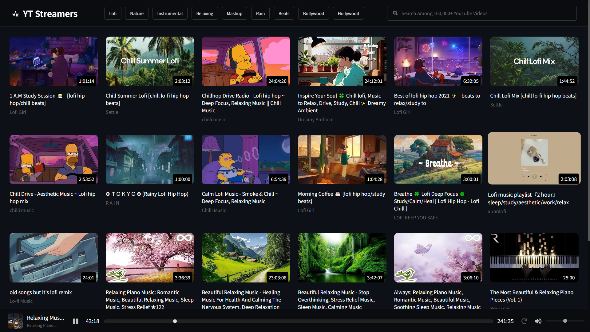

# YT Streamers - Enhance Your YouTube Browsing Experience!

YT Streamers is a web application that aims to elevate your YouTube experience by offering a range of exciting features:

1. **Data Consumption Optimization:** With YT Streamers, you can reduce data consumption significantly as it fetches only the audio of YouTube videos.

2. **Background Audio Playback:** Enjoy listening to your favorite YouTube content even while your device screen is off or while using other apps.

3. **Ad Removal:** Say goodbye to annoying ads! YT Streamers removes ads from the audio playback, providing a seamless and uninterrupted listening experience.

4. **Versatile Usage:** YT Streamers allows users to listen to audio-only content from any YouTube video, giving you the flexibility to consume content in a more focused manner.

Whether you want to save data, multitask while listening to content, or avoid pesky ads, YT Streamers has got you covered. Elevate your YouTube browsing experience today with YT Streamers at [ytstreamers.live](https://ytstreamers.live).

Stay tuned for more updates and features as we continue to improve your audio streaming experience!

For any inquiries or feedback, feel free to reach us at [contact@ytstreamers.live](mailto:contact@ytstreamers.live).

Happy streaming!

## Desktop View

